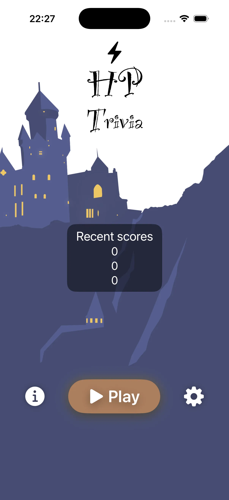

# HP Trivia ⚡️

An iOS trivia game set in the Wizarding World.
Asks questions from the books, trades points for hints, and unlocks later books through StoreKit.

<p align="center">
  
</p>

---

## 🧭 Features

* Questions grouped by book, with the last four locked behind purchases
* Animated home screen, gameplay transitions, and answer feedback
* Hint and book reveal tiles that cost a point each
* Recent score tracking across the last three games
* Sound effects and looping menu music
* Generated launch screen and Info.plist, no storyboard

---

## 🛠️ Tech Stack

* **Language:** Swift 6
* **UI:** SwiftUI
* **Platform:** iOS 18.0+
* **Architecture:** MV with observable state and pure rule services
* **Dependencies:** none

---

## 🚀 Setup

```bash
git config core.hooksPath .githooks   # enable swift-format pre-commit hook
open HPTrivia.xcodeproj
```

Build and run from Xcode, or use the CLI helper:

```bash
scripts/xc.sh build   # build for the pinned simulator
scripts/xc.sh test    # run the unit tests
```

---

## 📦 About

A learning project rebuilding a trivia game around SwiftUI animations. Question picking, book
grouping, and score history live in `GameRules` as pure functions, so the rules are covered by
tests without touching the UI.

Based on [this Udemy course](https://www.udemy.com/share/105Kw03@MsOVQvQjQxfRA4CRYG1dC2IVV1nYO0O0fLligAm5ImYq1S2nNAgWwW-D8RgHBCD_8w==/).
